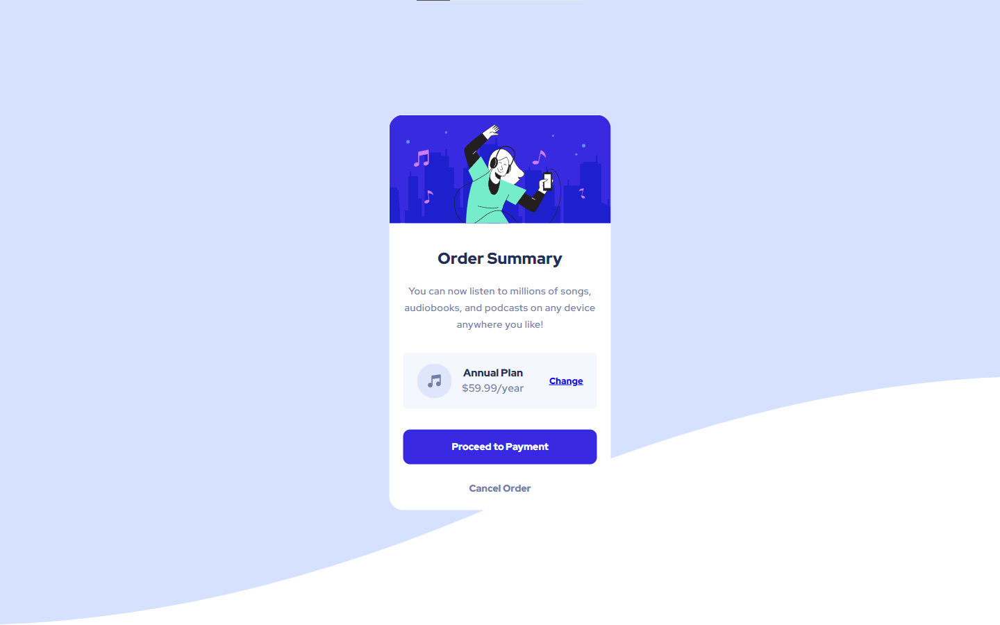

# Frontend Mentor - Order summary card solution

This is a solution to the [Order summary card challenge on Frontend Mentor](https://www.frontendmentor.io/challenges/order-summary-component-QlPmajDUj). Frontend Mentor challenges help you improve your coding skills by building realistic projects. 

## Table of contents

- [Overview](#overview)
  - [The challenge](#the-challenge)
  - [Screenshot](#screenshot)
  - [Links](#links)
- [My process](#my-process)
  - [Built with](#built-with)
  - [Continued development](#continued-development)
  - [Useful resources](#useful-resources)

**Note: Delete this note and update the table of contents based on what sections you keep.**

## Overview

### The challenge

Users should be able to:

- See hover states for interactive elements

### Screenshot

### Links

- Solution URL: [FEM Solution](https://your-solution-url.com)
- Live Site URL: [Live Site URL](https://jplawrence.github.io/ordersummarycomp/)

## My process

I started doing the mobile version first. I checked the style guides for the resources like font families and font sizes. I then basically just started the html markup keeping in mind the best practises. (That I'm aware of...) I then kept the design image in one tab and started styling the html to what I thought was closest to the design.

### Built with

- Semantic HTML5 markup
- CSS custom properties (Media Queries)
- Flexbox
- Mobile-first workflow

### Continued development

I definitely need to spend more time on responsive design, and more specifically, media queries. I feel like there are definitely tons of efficient ways to manage my code and make it reuseable!

### Useful resources

- [Media Queries](https://www.w3schools.com/css/css_rwd_mediaqueries.asp) - I don't think I needed this for this project specifically, but the tutorial highlights a lot a key factors and little detailed explanations.
- [Box Shadow](https://www.w3schools.com/cssref/css3_pr_box-shadow.asp) - I think the button had a box shadow on it...I've never used the box shadow, but again, I found this URL very helpful!

